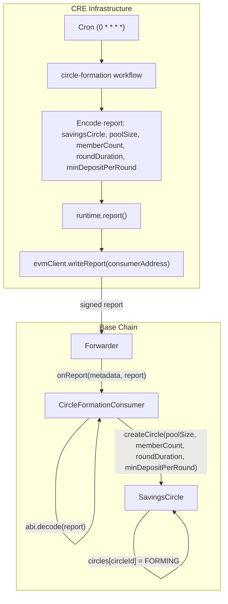
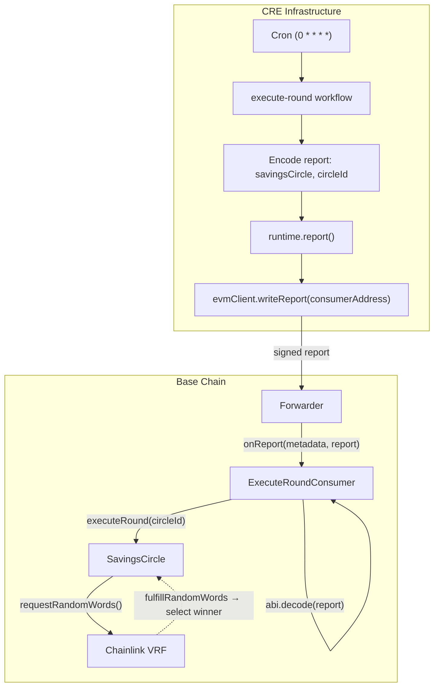
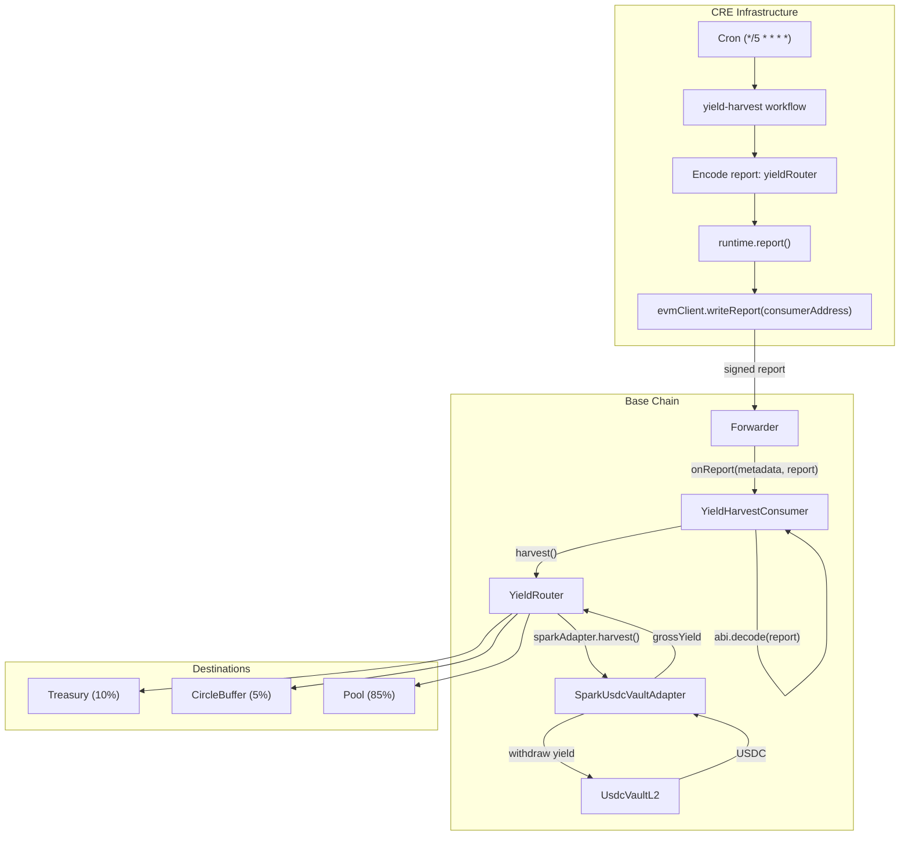

# CRE Workflows — Mandinga Protocol Automation

This document describes how **Chainlink Request Execution (CRE)** workflows are used in the Mandinga protocol: what they do, why they exist, and how each flow works.

---

## 1. What is CRE and Why Mandinga Uses It

**Chainlink Request Execution (CRE)** is a decentralized automation platform that runs off-chain workflows and can trigger on-chain transactions. Mandinga uses CRE to:

- **Automate time-based operations** — Cron triggers run workflows on a schedule without manual intervention
- **Avoid centralized keepers** — No single private key or server; CRE nodes execute workflows in a decentralized way
- **Write on-chain via reports** — Workflows produce signed reports that Consumer contracts verify and use to call protocol functions
- **Stay stateless** — Workflows read state from the chain; no off-chain database required

### Report + writeReport Pattern

All Mandinga workflows follow the same pattern:

```
Workflow (off-chain)                    Chain (on-chain)
─────────────────────                  ─────────────────
1. Encode payload (ABI params)
2. runtime.report() → signed report
3. evmClient.writeReport(receiver)  →  Forwarder → Consumer.onReport()
                                         └→ Consumer._processReport()
                                            └→ Protocol contract (SavingsCircle, YieldRouter)
```

The workflow never holds private keys. It produces a **report** (signed payload). The CRE infrastructure delivers this report to a **Consumer** contract via a **Forwarder**. The Consumer decodes the report and calls the target protocol function.

---

## 2. Architecture Overview

```
┌─────────────────────────────────────────────────────────────────────────────┐
│                         CRE Infrastructure (Chainlink)                       │
│  ┌─────────────┐    ┌──────────────┐    ┌─────────────────────────────────┐ │
│  │ Cron Trigger│───►│ Workflow Run │───►│ runtime.report() + writeReport() │ │
│  │ (schedule)  │    │ (TypeScript) │    │ (signed report → Forwarder)       │ │
│  └─────────────┘    └──────────────┘    └─────────────────────────────────┘ │
└─────────────────────────────────────────────────────────────────────────────┘
                                              │
                                              ▼
┌─────────────────────────────────────────────────────────────────────────────┐
│                              Base (EVM)                                     │
│  ┌──────────────┐    ┌─────────────────────┐    ┌───────────────────────┐ │
│  │   Forwarder  │───►│ Consumer Contract   │───►│ Protocol Contract      │ │
│  │ (Chainlink)  │    │ (CircleFormation,   │    │ (SavingsCircle,         │ │
│  │              │    │  ExecuteRound,     │    │  YieldRouter)           │ │
│  │              │    │  YieldHarvest)      │    │                         │ │
│  └──────────────┘    └─────────────────────┘    └───────────────────────┘ │
└─────────────────────────────────────────────────────────────────────────────┘
```

| Component | Role |
|-----------|------|
| **Cron Trigger** | Fires workflow on schedule (e.g. every hour, every 5 min) |
| **Workflow** | TypeScript logic: encode report, call `runtime.report()`, `evmClient.writeReport()` |
| **Forwarder** | Chainlink-owned contract that forwards reports to Consumers (MockForwarder for sim, KeystoneForwarder for prod) |
| **Consumer** | Extends `ReceiverTemplate`; decodes report, calls protocol |
| **Protocol** | SavingsCircle, YieldRouter — core Mandinga contracts |

---

## 3. Workflow: Circle Formation

### What

Creates a new **SavingsCircle** (ROSCA) on-chain with fixed parameters: `poolSize`, `memberCount`, `roundDuration`, `minDepositPerRound`.

### Why

- **Automation** — Circle creation can be triggered by a backend or queue of intents; no user needs to submit the tx manually
- **Consistency** — Parameters come from config or intent aggregation, not ad-hoc user input
- **Permissionless** — Anyone can run the workflow; the Consumer enforces that only valid reports from the CRE Forwarder are accepted

### Flow Diagram



### Sequence (ASCII)

```
Cron (hourly) → circle-formation/index.ts
    → createCircle(runtime, evmConfig, poolSize, memberCount, roundDuration, minDepositPerRound)
        → encodeAbiParameters([savingsCircle, poolSize, memberCount, roundDuration, minDepositPerRound])
        → runtime.report({ encodedPayload, encoderName: "evm", ... })
        → evmClient.writeReport(receiver: consumerAddress, report)
            → Forwarder forwards to CircleFormationConsumer
                → Consumer._processReport(report)
                    → abi.decode(report) → (savingsCircle, poolSize, memberCount, roundDuration, minDepositPerRound)
                    → ISavingsCircle(savingsCircle).createCircle(...)
                        → SavingsCircle creates circle in FORMING state
```

### Config (example)

| Key | Description |
|-----|-------------|
| `schedule` | `0 * * * *` (every hour) |
| `evms[0].consumerAddress` | Deployed CircleFormationConsumer |
| `evms[0].savingsCircleAddress` | SavingsCircle contract |
| `poolSize` | Total pool in base units (e.g. 1e9 = 1000 USDC) |
| `memberCount` | Number of members (e.g. 4) |
| `roundDuration` | Round length in seconds |
| `minDepositPerRound` | Optional; Safety Net min installment |

---

## 4. Workflow: Execute Round

### What

Calls `SavingsCircle.executeRound(circleId)` for a specific circle. This kicks off the VRF-based selection of the round winner.

### Why

- **Permissionless execution** — `executeRound()` is designed to be callable by anyone; selection is determined solely by Chainlink VRF
- **Automation** — Runs on schedule so rounds execute without members having to trigger manually
- **One circle per config** — Each workflow instance targets a single `circleId`; multiple circles need multiple workflow configs or a more dynamic design

### Flow Diagram



### Sequence (ASCII)

```
Cron (hourly) → execute-round/index.ts
    → executeRound(runtime, evmConfig, circleId)
        → encodeAbiParameters([savingsCircle, circleId])
        → runtime.report({ encodedPayload, encoderName: "evm", ... })
        → evmClient.writeReport(receiver: consumerAddress, report)
            → Forwarder → ExecuteRoundConsumer
                → Consumer._processReport(report)
                    → abi.decode(report) → (savingsCircle, circleId)
                    → ISavingsCircle(savingsCircle).executeRound(circleId)
                        → SavingsCircle.executeRound(circleId)
                            → requestRandomWords() → VRF
                            → (later) fulfillRandomWords() → select winner, update state
```

### Config (example)

| Key | Description |
|-----|-------------|
| `schedule` | `0 * * * *` (every hour) |
| `evms[0].consumerAddress` | Deployed ExecuteRoundConsumer |
| `evms[0].savingsCircleAddress` | SavingsCircle contract |
| `circleId` | Target circle (e.g. `"2"`) |

---

## 5. Workflow: Yield Harvest

### What

Calls `YieldRouter.harvest()` to pull accrued yield from the underlying vault (e.g. Sky UsdcVaultL2) and distribute it (fee → treasury, buffer → CircleBuffer, net → pool).

### Why

- **Yield accrual is passive** — The vault’s share price increases over time; `harvest()` converts that into USDC and routes it
- **Needs periodic execution** — Without harvest, yield stays “virtual” in the vault; harvest makes it real and distributable
- **Permissionless** — Anyone can call `harvest()`; CRE automates it so it runs reliably on schedule
- **Circuit breaker & cooldown** — YieldRouter enforces safety (APY drop check, cooldown); workflow just triggers the call

### Flow Diagram



### Sequence (ASCII)

```
Cron (every 5 min) → yield-harvest/index.ts
    → harvest(runtime, evmConfig)
        → encodeAbiParameters([yieldRouter])
        → runtime.report({ encodedPayload, encoderName: "evm", ... })
        → evmClient.writeReport(receiver: consumerAddress, report)
            → Forwarder → YieldHarvestConsumer
                → Consumer._processReport(report)
                    → abi.decode(report) → (yieldRouter)
                    → IYieldRouter(yieldRouter).harvest()
                        → YieldRouter.harvest()
                            → circuit breaker check, cooldown check
                            → sparkAdapter.harvest() → withdraw yield from vault
                            → fee → treasury, buffer → CircleBuffer, net → pool
```

### Config (example)

| Key | Description |
|-----|-------------|
| `schedule` | `*/5 * * * *` (every 5 minutes) |
| `evms[0].consumerAddress` | Deployed YieldHarvestConsumer |
| `evms[0].yieldRouterAddress` | YieldRouter contract |

---

## 6. Summary Table

| Workflow | Schedule | Chain | Consumer | Target Contract | Purpose |
|----------|----------|-------|----------|-----------------|---------|
| **circle-formation** | `0 * * * *` (1h) | Base Sepolia / Mainnet | CircleFormationConsumer | SavingsCircle | Create new circle (FORMING) |
| **execute-round** | `0 * * * *` (1h) | Base Sepolia / Mainnet | ExecuteRoundConsumer | SavingsCircle | Execute round, trigger VRF selection |
| **yield-harvest** | `*/5 * * * *` (5 min) | Base Sepolia / Mainnet | YieldHarvestConsumer | YieldRouter | Harvest yield, distribute fee/buffer/net |

---

## 7. Planned Workflows (Not Yet Implemented)

The README references two additional workflows that are not yet in the codebase:

| Workflow | Purpose |
|----------|---------|
| **safety-pool-monitor** | Read-only; monitor SafetyNetPool health, alert on anomalies |
| **reallocation-trigger** | Initiate reallocation with 1-round grace period |

---

## 8. Running Workflows

```bash
# From workflows/
cd workflows

# Simulate (dry run)
cre workflow simulate circle-formation --target base-sepolia
cre workflow simulate execute-round --target base-sepolia
cre workflow simulate yield-harvest --target base-sepolia

# Execute real transactions
cre workflow simulate circle-formation --target base-sepolia --broadcast
```

See [workflows/README.md](./README.md) for setup, ABI sync, and Consumer deployment.
